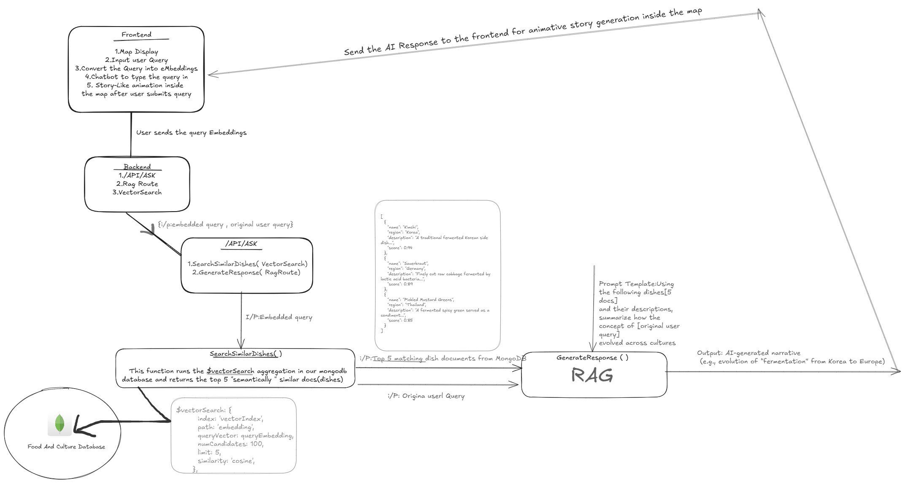

# 🌍 Food-Culture Map

**Food-Culture Map** is an interactive platform where users can explore the rich history and evolution of foods across different cultures and geographies. By asking questions like *"How did pizza originate?"*, users are presented with AI-generated narratives and an animated map journey that highlights the cultural roots of the food.

---

## 🚀 Features

- 🔍 **Semantic Search** using MongoDB vector search.
- 🤖 **RAG Pipeline**: Retrieval-Augmented Generation with Google Gemini's LLM.
- 🗺️ **Interactive Map Visualization** of food origins and cultural journeys.
- 🧠 **Embeddings-based Matching** powered by TensorFlow Universal Sentence Encoder.
- 🌐 **Multiservice Architecture** using React.js (frontend), Express.js & FastAPI (backend).

---

## 🧠 Tech Stack

| Layer       | Technology                            |
|-------------|----------------------------------------|
| Frontend    | React.js + TypeScript                 |
| Backend     | Express.js (Node.js)                  |
| Microservice | FastAPI (Python) for embedding pipeline |
| Database    | MongoDB with Vector Search            |
| AI Model    | Google's Gemini API (LLM) + Universal Sentence Encoder ( Tensorflow)  |
| Containerization  | Docker |
| Deployment  | Versal |

---

## 🗂️ Data Model

The dataset is sourced from **[Kaggle - Food Culture Dataset](https://www.kaggle.com/)** and enriched with vector embeddings using Universal Sentence Encoder.  
Each document in MongoDB has the following fields:

```ts
{
  id: string;
  foodName: string;
  region: string;
  country: string;
  image: string;
  description: string;
  location: string;
  latitude: number;
  longitude: number;
  timeOrigin: string;
  type: string;
  culturalSignificance: string;
  ingredients: string[];
  embeddings: number[];
}
```
## 🔄 How It Works

### 🧾 Data Preparation
- The **food culture dataset** is seeded into MongoDB.
- **Embeddings** are generated using TensorFlow’s [`universal-sentence-encoder`](https://www.npmjs.com/package/@tensorflow-models/universal-sentence-encoder).
- Each document is enriched with an `embeddings` field for semantic search.

### 🧠 Query Processing
- User input from the frontend is transformed into an embedding.
- This embedding is sent to the backend as part of the search request.

### 🔍 Vector Semantic Search
- The backend uses **MongoDB’s vector search** feature to retrieve the top 5 semantically similar documents from the collection.

### 📝 Story Generation
- These top 5 documents are sent to **Google Gemini's LLM** via a **Retrieval-Augmented Generation (RAG)** pipeline.
- The LLM generates a **narrative story** based on the cultural and historical context of the food.

### 🗺️ Frontend Visualization
- The story is shown on the frontend along with **animated navigation on a map**, tracing the evolution and journey of the food across regions.

---

## 🖼️ Architecture Diagram



---

## 🛠️ Setup Instructions

### ✅ Prerequisites

Make sure you have the following installed:

- [Node.js](https://nodejs.org/) (Latest LTS version)
- [Python 3.8+](https://www.python.org/downloads/)
- [MongoDB](https://www.mongodb.com/atlas/database) (With **vector search** feature enabled)
- [Google Gemini API Key]([https://ai.google.dev/gemini-api/docs/api-key])

## 🔧 Setup Instructions

### 1. Clone the Repository and run the frontend

```bash
git clone https://github.com/Rajukrsna/FoodCultureMap.git
npm i
npm run dev

```
### 2. Run the Backend

```bash
cd backend
npm i
npx nodemon server.js

```

### ⚙️ Environment Variables

Make sure to create a `.env` file in the `backend` directory and populate it with the following variables:

```env
MONGO_URI=your_mongodb_connection_string
GEMINI_API=your_openai_or_gemini_api_key
```
